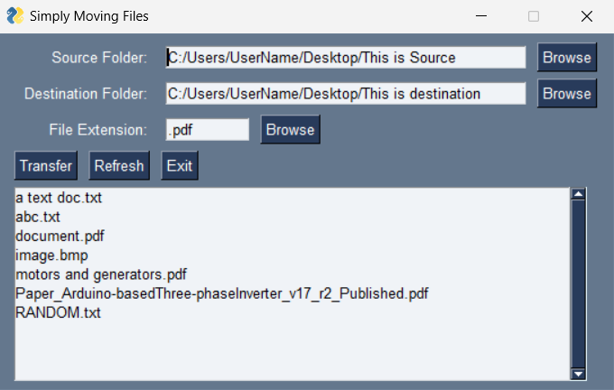

# Python File Mover Readme
## Introduction

The File Mover Python script is a simple utility built with PySimpleGUI that allows users to effortlessly move multiple files of the same extensions from one directory to another. Whether you need to organize your files, sort them into specific folders, or perform any other bulk file movement tasks, this script simplifies the process.

## Features

- Move multiple files of the same extensions in one go.
- Customize source and destination directories.
- Easily select file extensions to be moved.
- User-friendly PySimpleGUI-based graphical user interface.

## Running the Executable

If you prefer not to run the script using Python, you can also use the pre-built executable provided in the "Release" section of this repository. Here's how to do it:

1. Go to the [Releases]([https://github.com/yourusername/file-mover/releases](https://github.com/LibertyKapungu/PySimpleGUI-File-Mover/releases)) section of this repository.

2. Download the latest release, which includes the executable file.

3. Run the executable file on your system.

## Screenshots

